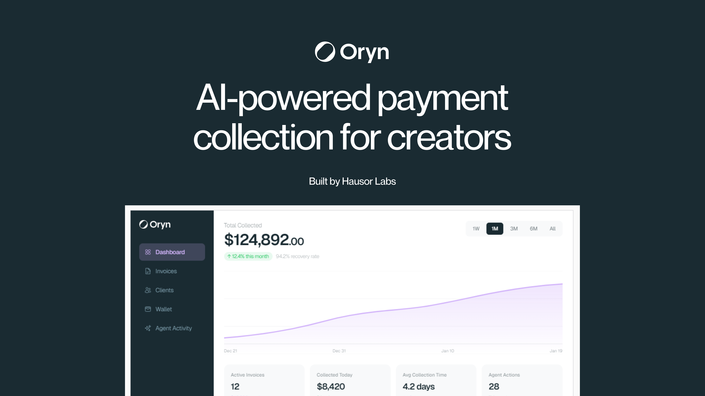
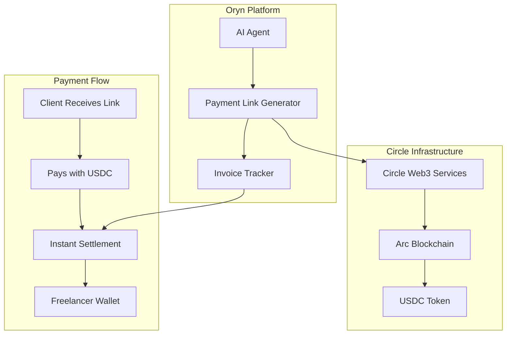
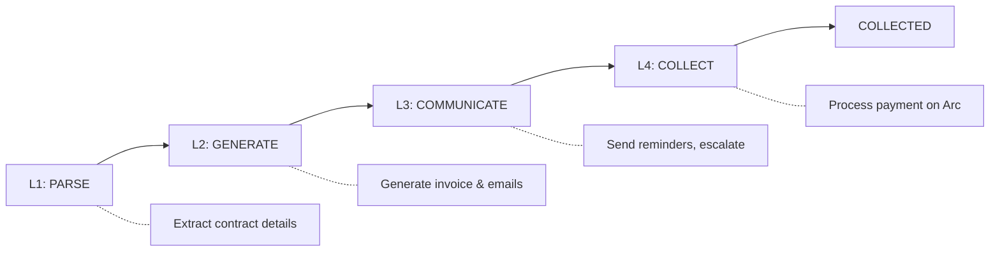
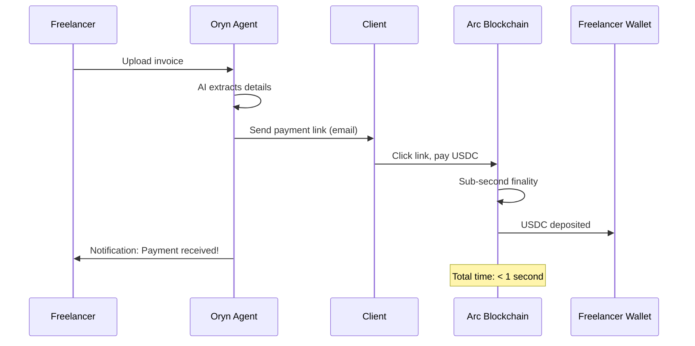

<p align="center">
  
</p>

<h1 align="center">Oryn</h1>

<p align="center">
  <strong>The follow-up small businesses never get around to doing.</strong><br>
  <em>You Work. Oryn Collects.</em>
</p>

<p align="center">
  You finished the job and sent the invoice. Then nothing. Chasing that money is awkward,<br>
  it eats hours, and it strains the client you need for the next job, so most people give up.<br>
  Oryn does the chasing for you, on its own, until you are paid.
</p>

<p align="center">
  <a href="https://oryn.cc">Live Demo</a> |
  <a href="PITCH.md">Pitch</a> |
  <a href="#autonomous-agent-architecture">AI Architecture</a> |
  <a href="#circle-arc-integration">Payment Rails</a>
</p>

<p align="center">
  
  
  
</p>

<p align="center">
  
  
  
  
</p>

---

## Watch the Demo

| Platform | Link |
|----------|------|
| Live Application | [https://oryn.cc](https://oryn.cc) |
| Video Walkthrough | [Watch on Canva](https://www.canva.com/design/DAG_SFV8WHw/ORTSg3XoP7hvQOHo2AeYSA/watch) |
| Dashboard Demo | [https://oryn.cc/dashboard](https://oryn.cc/dashboard) |

---

## The Problem We Solve

Freelancers face a universal pain point: **getting paid is hard, slow, and awkward**.

| Statistic | Impact |
|-----------|--------|
| 63% of freelancers | Wait 30+ days for payment |
| 85% of freelancers | Are paid late regularly |
| $8,400 per year | Average loss per freelancer |
| $89 billion annually | Lost productivity industry-wide |

**The Current Reality:**
- Manual invoice creation is tedious and error-prone
- Sending payment reminders is awkward and uncomfortable
- Bank transfers take 3-5 business days (or longer internationally)
- Payment platforms charge 2.9% + fees
- Freelancers waste hours every month on payment administration

---

## The Solution

**Oryn** is an autonomous AI agent that manages the entire payment lifecycle:

```
Upload Contract --> AI Parses Details --> Invoice Generated --> Email Sent
                --> Payment Collected --> Instant USDC Settlement on Arc
```

| Step | What Happens | Technology Used |
|------|--------------|-----------------|
| 1. Upload | Drop any contract, invoice, or agreement | AI Document Parsing |
| 2. Extract | AI extracts client name, email, amount, due date | Gemini / GPT-4o |
| 3. Activate | One click to start autonomous collection | Marathon Agent |
| 4. Collect | Agent sends reminders via email, SMS, WhatsApp | Multi-channel AI |
| 5. Get Paid | Client pays USDC on Arc blockchain | Circle Arc + USDC |
| 6. Settle | Funds arrive in your wallet instantly | Sub-second finality |

**Zero manual follow-ups. Zero awkward conversations. Zero waiting for bank transfers.**

---

## Circle Arc Integration

Oryn is built specifically for **Circle's Arc blockchain**, leveraging its unique capabilities for agentic commerce.

### Why Arc is Perfect for Payment Collection

| Arc Feature | How Oryn Uses It | Benefit |
|-------------|------------------|---------|
| **Sub-second Finality** | Payments confirm instantly when client pays | No more "payment pending" limbo |
| **USDC as Native Gas** | Transaction fees paid in USDC, not a separate token | Simpler UX, no gas token complexity |
| **Native USDC** | All payments settled in stable value | No crypto volatility for freelancers |
| **Low Transaction Costs** | Minimal fees per transaction | Small invoices ($50-500) become viable |
| **Global Settlement** | Anyone with a wallet can pay from anywhere | No country restrictions, 24/7/365 |

### Circle Products Integration



| Circle Product | Integration Point | Purpose |
|----------------|-------------------|---------|
| **Arc Blockchain** | Payment settlement layer | Sub-second finality for all payments |
| **USDC Stablecoin** | Payment currency | Stable value, global acceptance |
| **Circle Web3 Services** | Wallet management | Create and manage USDC wallets |
| **Programmable Wallets** | Agent-owned wallets | AI agent can receive and forward payments |

### Traditional Payments vs Arc

| Aspect | Traditional (Stripe/PayPal) | Arc + USDC |
|--------|----------------------------|------------|
| Settlement time | 3-5 business days | **Sub-second** |
| Chargebacks | Possible for 120+ days | **Final and irreversible** |
| Transaction fees | 2.9% + $0.30 | **Minimal USDC fees** |
| Geographic limits | Country restrictions | **Global access** |
| Business hours | Bank hours only | **24/7/365** |
| Currency conversion | 3-5% forex fees | **Native USD value** |

---

## Autonomous Agent Architecture

Oryn implements a **Marathon Agent** pattern, an autonomous system that operates continuously over days or weeks to achieve a goal.

### What Makes Oryn a True Autonomous Agent

| Capability | Implementation | Why It Matters |
|------------|----------------|----------------|
| **Persistent State** | Thought Signatures stored in Convex | Agent remembers every interaction across sessions |
| **Self-Correction** | Error detection and recovery logic | Agent fixes its own mistakes without human intervention |
| **Goal-Oriented** | Works toward payment collection | Not just responding to prompts, actively pursuing outcomes |
| **Multi-Channel** | Email, SMS, WhatsApp orchestration | Reaches clients on their preferred channel |
| **Adaptive Escalation** | Tone adjustment based on response | Starts friendly, escalates appropriately |

### Thought Signatures: Persistent AI Reasoning

Unlike chatbots that forget context, Oryn maintains **Thought Signatures** - persistent reasoning state that survives across sessions:

```typescript
// Thought Signature Schema (simplified)
{
  claimId: "claim_123",
  level: "L3_COMMUNICATE",  // Current thinking level
  context: {
    clientName: "Marcus Thompson",
    invoiceAmount: 7000,
    daysSinceDue: 8,
    attemptHistory: [
      { channel: "email", sentAt: "...", result: "opened" },
      { channel: "email", sentAt: "...", result: "clicked" }
    ],
    clientSentiment: "neutral"
  },
  nextAction: {
    action: "send_reminder",
    channel: "email",
    reasoning: "Invoice is 8 days overdue. Previous emails opened but no payment. Escalating to firm reminder."
  }
}
```

### Agent Thinking Levels

The agent progresses through distinct thinking levels:



| Level | Name | What Happens |
|-------|------|--------------|
| L1 | PARSE | Extract client info, amounts, due dates from uploaded documents |
| L2 | GENERATE | Create professional invoices and initial communication |
| L3 | COMMUNICATE | Send reminders, handle responses, escalate as needed |
| L4 | COLLECT | Process payment, verify on Arc, update records |

### Smart Escalation Timeline

The AI automatically adjusts communication tone based on time and client behavior:

| Day | Escalation Level | Tone | Example Message |
|-----|------------------|------|-----------------|
| 0 | Level 0 | Friendly | "Hi! Just a quick reminder about invoice #147..." |
| 7 | Level 1 | Follow-up | "Checking in on the invoice. Let me know if you need anything!" |
| 14 | Level 2 | Firm | "Payment is now overdue. Please arrange payment at your earliest convenience." |
| 21 | Level 3 | Urgent | "Final reminder before we explore other options." |
| 30 | Level 4 | Final | "This is our final notice regarding the outstanding amount." |

### Self-Correction Example

When errors occur, the agent detects and recovers automatically:

```
[Agent] Attempting to send email to client...
[Error] Email bounced - invalid address
[Agent] Detected error: email_bounce
[Agent] Correction: Trying SMS channel instead
[Agent] SMS sent successfully
[Agent] Updated thought signature: prefer SMS for this client
```

---

## Payment Flow

### End-to-End Transaction Flow on Arc



### Payment Methods Supported

| Method | Settlement | Fees | Availability |
|--------|------------|------|--------------|
| **USDC on Arc** | Instant | Minimal | Global, 24/7 |
| Credit/Debit Card | 2-3 days | 2.9% + $0.30 | Most countries |
| Bank Transfer (ACH) | 3-5 days | Low | US only |

---

## Business Model

| Revenue Stream | Fee | Description |
|----------------|-----|-------------|
| Transaction Fee | 1% | On successful collections via USDC |
| Subscription | $0-99/mo | Tiered plans for volume users |

### Market Opportunity

| Metric | Value |
|--------|-------|
| Global freelancer population | 1.57 billion |
| US freelancer market | 70 million |
| Annual unpaid invoices | $89 billion |
| Freelancers paid late | 85% |

---

## Tech Stack

| Layer | Technology | Why We Chose It |
|-------|------------|-----------------|
| **Frontend** | Next.js 15, React 19, TypeScript | Server components, streaming, type safety |
| **Styling** | Tailwind CSS, shadcn/ui | Rapid UI development, consistent design |
| **Backend** | Convex | Real-time subscriptions, serverless functions, ACID transactions |
| **Authentication** | Clerk | Secure auth, session management, webhooks |
| **Blockchain** | Circle Arc | Sub-second finality, USDC-native gas |
| **AI** | Gemini 2.0 Flash (primary), GPT-4o (fallback) | Fast inference, document understanding |
| **Email** | Resend | Reliable transactional email |
| **SMS** | Twilio | Global SMS delivery |
| **Hosting** | Vercel | Edge deployment, automatic scaling |

---

## Project Structure

```
oryn/
├── apps/
│   ├── web/                              # Main dashboard application
│   │   ├── app/
│   │   │   ├── dashboard/                # Freelancer dashboard
│   │   │   │   ├── claims/               # Claim management
│   │   │   │   ├── clients/              # Client management
│   │   │   │   ├── wallet/               # USDC wallet
│   │   │   │   └── settings/             # User preferences
│   │   │   └── api/                      # API routes
│   │   └── components/                   # React components
│   │
│   └── pay/                              # Payment portal (pay.oryn.cc)
│       └── app/
│           └── [token]/                  # Dynamic payment pages
│
├── packages/
│   └── database/
│       └── convex/                       # Convex backend
│           ├── schema.ts                 # 22-table database schema
│           ├── claims.ts                 # Claim operations
│           ├── wallets.ts                # Arc wallet management
│           ├── payments.ts               # Payment processing
│           ├── messages.ts               # Multi-channel messaging
│           ├── thoughtSignatures.ts      # Agent state persistence
│           └── agentSessions.ts          # Agent execution tracking
│
└── docs/
    ├── ARCHITECTURE.md                   # System architecture
    ├── DATABASE_SCHEMA.md                # Schema documentation
    └── INTEGRATIONS.md                   # Third-party integrations
```

### Key Files for Judges

| File | What It Demonstrates |
|------|----------------------|
| `packages/database/convex/schema.ts` | Complete 22-table schema including Thought Signatures |
| `packages/database/convex/thoughtSignatures.ts` | Marathon Agent state persistence |
| `packages/database/convex/wallets.ts` | Circle Arc wallet integration |
| `apps/web/app/dashboard/wallet/page.tsx` | USDC wallet UI with Arc support |
| `apps/pay/app/[token]/page.tsx` | Payment collection interface |

---

## Getting Started

### Prerequisites

```bash
Node.js 18+
pnpm (recommended) or npm
```

### Quick Start

```bash
# Clone the repository
git clone https://github.com/brn-mwai/oryn-agentic-commerce-on-arc.git
cd oryn-agentic-commerce-on-arc

# Install dependencies
pnpm install

# Set up environment variables
cp .env.example .env.local

# Start development
pnpm dev
```

### Environment Variables

| Variable | Required | Description |
|----------|----------|-------------|
| `NEXT_PUBLIC_CONVEX_URL` | Yes | Convex deployment URL |
| `NEXT_PUBLIC_CLERK_PUBLISHABLE_KEY` | Yes | Clerk public key |
| `CLERK_SECRET_KEY` | Yes | Clerk secret key |
| `CIRCLE_API_KEY` | Yes | Circle API key for Arc |
| `RESEND_API_KEY` | Yes | Email delivery |
| `GEMINI_API_KEY` | Yes | AI document parsing |

---

## AI Mashinani 2026

| Capability | How Oryn Delivers It |
|------------|----------------------|
| **AI agent that transacts autonomously** | Oryn's agent owns a wallet, sends invoices, and processes payments without human approval |
| **Onchain settlement** | All USDC payments settle on Circle's Arc with sub-second finality |
| **Agentic decision-making** | Agent decides when to escalate, which channel to use, how to phrase messages |
| **Real value transfer** | Actual USDC moves from client to freelancer |

### Innovation Highlights

| Innovation | Description |
|------------|-------------|
| **Marathon Agent Pattern** | Agent operates continuously over weeks, not just single requests |
| **Thought Signatures** | Persistent AI reasoning that survives across sessions |
| **Self-Correcting Agent** | Detects errors and adjusts strategy automatically |
| **Multi-Channel Orchestration** | Coordinates email, SMS, WhatsApp based on client behavior |

---

## Roadmap

| Feature | Timeline | Description |
|---------|----------|-------------|
| EURC Support | Q1 2026 | Euro-denominated invoices for European freelancers |
| QuickBooks Integration | Q1 2026 | Auto-sync invoices from accounting software |
| WhatsApp Business API | Q2 2026 | Rich payment reminders with inline payment buttons |
| Mobile App | Q2 2026 | iOS and Android apps for on-the-go management |
| Multi-language AI | Q2 2026 | Spanish, French, German, Portuguese support |

---

## Team

**Brian Mwai** - Founder & Developer

| Platform | Link |
|----------|------|
| GitHub | [@brn-mwai](https://github.com/brn-mwai) |
| Twitter | [@brn_mwai](https://twitter.com/brn_mwai) |
| LinkedIn | [Brian Mwai](https://linkedin.com/in/brn-mwai) |

Built by **Hausor Labs**

---

## Team

<table>
  <tr>
    <td align="center">
      <a href="https://github.com/brn-mwai"><br><b>Brian Mwai</b></a><br>
      <sub>Architecture, agent runtime</sub>
    </td>
    <td align="center">
      <a href="https://github.com/Mathew-Rym"><br><b>Mathew Rym</b></a><br>
      <sub>Frontend, demo experience</sub>
    </td>
    <td align="center">
      <a href="https://github.com/Abdikhafar-hub"><br><b>Abdikhafar</b></a><br>
      <sub>Agent reasoning, security</sub>
    </td>
    <td align="center">
      <a href="https://github.com/Yusuf-cm"><br><b>Yusuf</b></a><br>
      <sub>Payments, integration tests</sub>
    </td>
    <td align="center">
      <a href="https://github.com/josephwakaro"><br><b>Joseph Wakaro</b></a><br>
      <sub>Data layer, analytics</sub>
    </td>
  </tr>
</table>

Areas of ownership are in [TEAM.md](TEAM.md). Open work is tracked in [issues](https://github.com/brn-mwai/oryn-ai-mashinani/issues).

---

## License

MIT License - see [LICENSE](LICENSE) for details.

---

<p align="center">
  <strong>Entered into AI Mashinani 2026</strong>
</p>

<p align="center">
  <a href="https://oryn.cc">oryn.cc</a>
</p>
