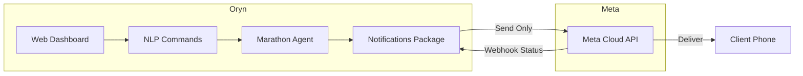
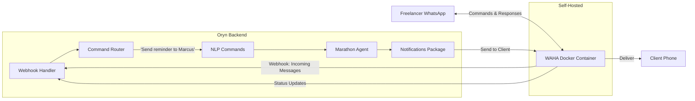

# WAHA Integration Guide for Oryn

## TL;DR — What You're Building

You want the **freelancer (you)** to be able to control Oryn's payment collection process *from WhatsApp itself* — not just use WhatsApp as an outbound notification channel. WAHA replaces the Meta Cloud API as the WhatsApp transport layer, and a new **command router** on the webhook side lets you send natural-language or structured commands via WhatsApp to manage claims, trigger collections, check statuses, etc.

---

## Current State vs. Target State

````carousel
### Current Architecture

> WhatsApp is **outbound-only** — sends reminders to clients. The freelancer controls everything via the web dashboard.

<!-- slide -->

### Target Architecture with WAHA

> WhatsApp becomes a **bidirectional control plane** — the freelancer sends commands AND clients receive messages through the same WAHA instance.
````

---

## Why WAHA Instead of Keeping Meta Cloud API?

| Factor | Meta Cloud API (current) | WAHA |
|--------|--------------------------|------|
| **Cost** | Per-message fees + template approval | Free (self-hosted, server cost only) |
| **Setup** | Business verification, weeks | QR code scan, minutes |
| **Template approval** | Required for all outbound | Not needed — send anything |
| **Bidirectional** | Yes, but complex webhook setup | Yes, simple REST + webhook |
| **Self-hosted** | No | Yes (Docker) |
| **Risk** | Official, safe | Unofficial — risk of ban if abused |
| **Rich messages** | Buttons, flows, templates | Text, images, docs, buttons |

> [!WARNING]
> WAHA uses an unofficial WhatsApp protocol (Baileys). For **production** with real clients, this carries ban risk. For hackathon/demo purposes at AI Mashinani, it's perfect. You can always keep the Meta Cloud API as a fallback.

---

## What Changes vs. What Stays

### ✅ Stays Untouched
- [schema.ts](file:///home/rym/Documents/ACCELERATOR/Claude/oryn-ai-mashinani/packages/database/convex/schema.ts) — no schema changes needed
- [messages.ts](file:///home/rym/Documents/ACCELERATOR/Claude/oryn-ai-mashinani/packages/database/convex/messages.ts) — already supports `whatsapp` channel + `whatsappMsgId`
- [thoughtSignatures.ts](file:///home/rym/Documents/ACCELERATOR/Claude/oryn-ai-mashinani/packages/database/convex/thoughtSignatures.ts) — already supports `whatsapp` in `recordAttempt`
- [nlpCommands.ts](file:///home/rym/Documents/ACCELERATOR/Claude/oryn-ai-mashinani/packages/database/convex/nlpCommands.ts) — works as-is for command processing
- [notifications/src/index.ts](file:///home/rym/Documents/ACCELERATOR/Claude/oryn-ai-mashinani/packages/notifications/src/index.ts) — unified interface stays the same

### 🔄 Modified
| File | What Changes |
|------|-------------|
| [whatsapp/client.ts](file:///home/rym/Documents/ACCELERATOR/Claude/oryn-ai-mashinani/packages/notifications/src/whatsapp/client.ts) | Point to WAHA API instead of `graph.facebook.com` |
| [whatsapp/send.ts](file:///home/rym/Documents/ACCELERATOR/Claude/oryn-ai-mashinani/packages/notifications/src/whatsapp/send.ts) | Adapt payload format to WAHA's REST API |
| [whatsapp/webhook.ts](file:///home/rym/Documents/ACCELERATOR/Claude/oryn-ai-mashinani/packages/notifications/src/whatsapp/webhook.ts) | Parse WAHA webhook format instead of Meta's format |
| `.env` | New WAHA-specific env vars |

### 🆕 New Files
| File | Purpose |
|------|---------|
| `packages/notifications/src/whatsapp/waha-client.ts` | WAHA-specific API client |
| `apps/web/app/api/whatsapp-waha/webhook/route.ts` | Next.js API route for WAHA webhooks |
| `packages/notifications/src/whatsapp/command-router.ts` | Routes incoming WhatsApp messages to NLP/actions |
| `docker-compose.waha.yml` | Docker compose for running WAHA |

---

## Implementation Plan

### Phase 1: Deploy WAHA (30 min)

**Docker Compose file** at project root:

```yaml
# docker-compose.waha.yml
version: '3.8'
services:
  waha:
    image: devlikeapro/waha:latest
    ports:
      - "3000:3000"
    environment:
      - WHATSAPP_HOOK_URL=https://your-domain.com/api/whatsapp-waha/webhook
      - WHATSAPP_HOOK_EVENTS=message,message.any,session.status
      - WHATSAPP_HOOK_HMAC_KEY=your-secret-key
      - WAHA_DASHBOARD_ENABLED=true
      - WAHA_DASHBOARD_USERNAME=admin
      - WAHA_DASHBOARD_PASSWORD=your-password
    volumes:
      - waha_data:/app/.sessions
    restart: unless-stopped

volumes:
  waha_data:
```

**Steps:**
1. `docker compose -f docker-compose.waha.yml up -d`
2. Open `http://localhost:3000` → WAHA dashboard
3. Start a session → scan QR code with your WhatsApp
4. Test: `curl -X POST http://localhost:3000/api/sendText -H 'Content-Type: application/json' -d '{"chatId":"254xxx@c.us","text":"Hello from Oryn!"}'`

### Phase 2: Adapt the WhatsApp Client (1-2 hrs)

Replace the Meta Cloud API calls in `client.ts` with WAHA calls. The key difference:

```diff
- const WHATSAPP_API_URL = "https://graph.facebook.com/v18.0";
+ const WAHA_API_URL = process.env.WAHA_API_URL || "http://localhost:3000";
+ const WAHA_SESSION = process.env.WAHA_SESSION || "default";

- // Meta Cloud API: POST /{phone_number_id}/messages
+ // WAHA: POST /api/sendText (or /api/sendImage, etc.)
```

**WAHA's key endpoints:**

| Action | WAHA Endpoint | Meta Equivalent |
|--------|--------------|-----------------|
| Send text | `POST /api/sendText` | `POST /{phone_id}/messages` |
| Send image | `POST /api/sendImage` | `POST /{phone_id}/messages` (type: image) |
| Send document | `POST /api/sendFile` | `POST /{phone_id}/messages` (type: document) |
| Send buttons | `POST /api/sendButtons` | Template with buttons |
| Check status | `GET /api/sessions/{session}/me` | N/A |
| Get QR code | `GET /api/{session}/auth/qr` | N/A |

**WAHA send text payload:**
```json
{
  "chatId": "254712345678@c.us",
  "text": "Hi Marcus! Reminder: Invoice #147 for $7,000 is due.",
  "session": "default"
}
```

### Phase 3: Webhook + Command Router (2-3 hrs) — The Key Part

This is where "controlling the process from WhatsApp" happens.

**WAHA sends webhook events like this:**
```json
{
  "event": "message",
  "session": "default",
  "payload": {
    "id": "true_254xxx@c.us_ABCDEF",
    "from": "254712345678@c.us",
    "to": "254700000000@c.us",
    "body": "Send reminder to Marcus",
    "timestamp": 1706000000,
    "fromMe": false,
    "hasMedia": false
  }
}
```

**Command Router** — maps incoming messages to Oryn actions:

```
┌─────────────────────────────────────────────────────┐
│  Incoming WhatsApp Message                          │
│  "Send reminder to Marcus for invoice 147"          │
└────────────────────┬────────────────────────────────┘
                     │
                     ▼
┌─────────────────────────────────────────────────────┐
│  1. Auth Check                                      │
│  Is sender's phone number linked to an Oryn user?   │
│  (Match against users table → phone field)          │
└────────────────────┬────────────────────────────────┘
                     │ ✅ Authorized
                     ▼
┌─────────────────────────────────────────────────────┐
│  2. Intent Detection                                │
│  Use existing NLP pipeline (Gemini/GPT) or          │
│  simple keyword matching for common commands        │
└────────────────────┬────────────────────────────────┘
                     │
        ┌────────────┼────────────────┐
        ▼            ▼                ▼
   ┌─────────┐ ┌──────────┐   ┌───────────┐
   │ STATUS  │ │  ACTION  │   │  QUERY    │
   │ Commands│ │  Commands│   │  Commands │
   └─────────┘ └──────────┘   └───────────┘
```

**Example commands the freelancer could send:**

| WhatsApp Message | Intent | Action |
|-----------------|--------|--------|
| `status` | `list_active` | List all active claims with amounts |
| `remind Marcus` | `send_reminder` | Trigger reminder for Marcus's claim |
| `how much does Sarah owe` | `query_amount` | Look up Sarah's outstanding balance |
| `pause claim 123` | `pause_claim` | Pause the agent for a specific claim |
| `escalate Marcus` | `escalate` | Bump escalation level for Marcus |
| `collect all` | `batch_remind` | Send reminders for all overdue claims |
| `dashboard` | `summary` | Send a summary of all claims + payments |
| `help` | `help` | Show available commands |

### Phase 4: Response Formatting (1 hr)

Format Oryn's responses nicely for WhatsApp:

```
📊 *Active Claims Summary*
━━━━━━━━━━━━━━━━━

1️⃣ *Marcus Thompson* — $7,000
   📅 Due: July 15 (11 days overdue)
   📬 Last reminder: Email, July 20
   🔴 Escalation: Level 2

2️⃣ *Sarah Chen* — $3,500
   📅 Due: July 28 (2 days left)
   📬 Last reminder: None
   🟢 Escalation: Level 0

━━━━━━━━━━━━━━━━━
💰 Total Outstanding: $10,500

Reply with a client name to take action.
```

---

## Environment Variables

Add these to your `.env`:

```bash
# ===========================================
# WAHA (WhatsApp HTTP API) - Self-hosted
# ===========================================
WAHA_API_URL=http://localhost:3000         # or your VPS URL
WAHA_SESSION=default                       # session name
WAHA_API_KEY=                              # optional API key
WAHA_WEBHOOK_HMAC_KEY=your-secret-key     # for verifying webhooks
WAHA_OWNER_PHONE=254712345678             # YOUR phone number (for auth)
```

> [!IMPORTANT]
> `WAHA_OWNER_PHONE` is critical — it's how the command router knows an incoming message is from the **owner** (you) vs. a **client reply**. Only the owner can execute commands.

---

## Key Decisions Before We Start

> [!NOTE]
> Please answer these before I start implementing:

1. **WAHA hosting**: Will you run WAHA locally (Docker on your machine) or on a VPS/cloud server? If cloud, where? (Railway, DigitalOcean, etc.)

2. **Dual-mode or WAHA-only?**: Should we keep the Meta Cloud API as a fallback (e.g., use WAHA for owner commands, Meta for client notifications), or go full WAHA?

3. **Command style**: Do you want:
   - **NLP-based** (natural language, uses AI to parse — "remind Marcus about his invoice") — leverages your existing `nlpCommands` infra
   - **Structured** (keyword-based — `/remind Marcus`, `/status`, `/escalate 123`) — simpler, no AI costs
   - **Both** (try keyword first, fall back to NLP)

4. **Client replies**: Should WAHA also handle client replies on WhatsApp? (e.g., client texts back "I'll pay tomorrow" → agent records this and adjusts strategy)

5. **Scope for AI Mashinani demo**: Do you want the full integration or a focused demo that shows the core "control from WhatsApp" flow?
